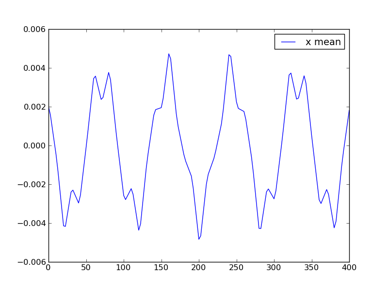

Examples
========

fodo
----

This is the simplest example the Synergia authors could think off. Such a system has been described on various
occasions (see for instance the notes from the USPAS accelerator school course by Mike Syphers_ et al). Both
single particle optic and collective effect are demonstrated. This example runs in a few minutes on a single CPU
(or core) system. 

The lattice is of the simple Focus-Defocus (FoDo) type: one focusing quadrupole followed by a short drift, 
then one defocusing quadrupole of the same strength and ending with a drift of the same length. 

To get going, first, execute the setup shell script found in the top level directory where the Synergia package
was installed::

  % source .../Synergia/synergia2-refactor/setup.sh 
 

A. Via The Python Interface. 
^^^^^^^^^^^^^^^^^^^^^^^^^^^^

The lattice is defined in just a few lines in the file ``fodo.lat``.  We first define the relevant constants::
  
   focus    :=   7                   ! [m]     : focal length of equivalent, thin quad
   sepn     :=  10                   ! [m]     : distance between quad centers
   length   :=   2.0                  ! [m]     : quadrupole length
   strength := 1/(focus*length)       ! [m**-2] : quadrupole strength
                                     !         :   = B'/brho

Next, we use these constants to define the elements of the lattice::

   o: drift, l=( sepn - length )
   f: quadrupole, l=length, k1=strength
   d: quadrupole, l=length, k1=(-strength)

Such elements are stitched together to form the lattice,  named appropriately ``fodo``, in one line::

   fodo:  line=( f, o, d, o )

Multiple such latices can be assembled together to make a more complete and complex machine.  We are not quite done yet:
Synergia and CHEF are more than just an optic code: Processes involving real EM fields will be simulated. Non-relativistic
effects could be considered. So a particle and an energy for the reference particle (i.e., the particle staying at the
center of the center of the 6D phase space) needs to be defined::

   beam, particle=proton, energy=1.5
   
This unique line in the lattice file can be inserted anywhere in the file, it makes sense to place at the beginning or at
the end, for sake of clarity. We are now ready to use this lattice. But, prior to run something, details on what we plan to
simulate must be defined.  This is done in two separate user defined Python scripts: the ``fodo_option.py`` and ``fodo.py``.
The first one can be viewed as a simple list of good-old fashion data statements specifying the details about the
simulation.  The second one is a list of action that takes while simulating the problem. To avoid unnecessary verbosity in
this document, let us refrain stating what all these options are, and briefly comment on the way they are defined. Theses
option are defined via a ``synergia_workflow``::

   opts = synergia_workflow.Options("fodo")
   opts.add("radius", 0.1, "aperture radius [m]", float)

A simple Python container class has the name in instantiated.  The option named ``radius`` has the value 0.1 meters, it's
brief definition appears in the thrid argument and it's type is single precision (32 bit, on most machines) floating point. 
It implies that any particles found at a radial distance of more than 10 cm will be lost. 

These options are then used in the main script in file ``fodo.py``.  Our simulation starts by reading the file containing
information about the lattice::

   lattice = synergia.lattice.Mad8_reader().get_lattice("fodo", "fodo.lat")

Let us use the options previously declared, for instance one can set the aperture restrictions::
    
   for elem in lattice.get_elements():
       elem.set_double_attribute("aperture_radius", opts.radius)

So far, we have a list ofaccelerator (or a beam line) elements,  forming a lattice. Let us implement this lattice in memory, 
with the relevant data structures instantiated, such that tracking can be done:: 

    lattice_simulator = synergia.simulation.Lattice_simulator(lattice,
                                                          opts.map_order)

The ``map_oder`` is an integer stating the order at which the CHEF maps will be computed. One also needs a bunch_.  This collection
must be matched to the machine.  That is, the correlation between ``x`` and ``xp`` (or ``y``, ``yp``) must be such that the betatron
oscillations at injection will smoothly match those of a bunch circulating in the machine.  We also need to declare the emittances,
the total charge in the bunch (i.e., the number of real particles) and the number of macro particles.  Since some stochastics
processes will be simulated, specifying the seed for reproducibility is a good idea as well::

    bunch = synergia.optics.generate_matched_bunch_transverse(
              lattice_simulator, opts.emit, opts.emit, opts.stdz, opts.dpop,
              opts.real_particles, opts.macro_particles,
              seed=opts.seed)

Next, the stepper_ is instantianted::

     stepper = synergia.simulation.Independent_stepper_elements(
                            lattice_simulator, opts.steps)

Only one option, the simplest is reproduced in this documentation file. Our intend is first to simulate the propagation
of a bunch in the machine without any collective effects.  One last declaration before starting the simulation:
diagnostics. While optional this is of course highly recommended if we want to derive some observations for our run:

    multi_diagnostics_turn.append(synergia.bunch.Diagnostics_full2(bunch, "turn_full2.h5"))

Again, for sake of brevity, only one such diagnostic request is shown here.  We have diagnostics for what happens on a
step by step or turn by turn basis.  Information about each macroparticles can also be obtained. See the ``Diagnostics``
class in the bunch_ documentation for more details. Finally, let us define the propagator for this run::

    propagator = synergia.simulation.Propagator(stepper)
    propagator.propagate(bunch, opts.turns,
                     multi_diagnostics_step,
                     multi_diagnostics_turn,
                     opts.verbose)
 

There is an important subtelty in this last line: the number of turns is now defined. It is indeed assumed that the ``fodo`` line
represent some kind of circular or repetitive system, where the bunch re-enters at the beginning of the lattice at each turns.  
Let us run this script::

    %synergia fodo.py
    

Two output files are produced `` step_full2.h5`` and  ``turn_full2.h5``.  These HDF5_ files contain the results of our simulation. 
They typically contain multiple ``DATASET`` that can be accessed via a simple ``dump`` command::

    %h5dump turn_full2.h5 
    
More sophistication is needed to extract meaningful information about the performance of the simulated accelerator. Here, the user
is either welcome to write his own analysis modules in his prefered computer languages (Python, C++, F90).  Conversely, for simple
task, specific Python scripts have been written to display, for instance, the emittance versus the turn number, or the position
(i.e. mean over the macro-particle) of the bunch in 6D phase space

Since our bunch is matched to the lattice, no collective effect, nor any kind of perturbation are applied, the emittance stays flat
and the bunch is on axis.  A rather boring (but good!) result. So, let up postpone the display of these results,
and re-inject the bunch, but let us displace this bunch on the horizontal plane by two milimeter.  After defining our original bunch, insert
the following lines of code::
 
    for part in range(0, bunch.get_local_num()):
         bunch.get_local_particles()[part][0] += .002
    	        

Since this is a perfect, matched lattice, again, the transverse emittances stay flat. However, the bunch oscillates on the
horizontal plane. To see this, let use the diagnostic and plot the the mean horizontal position at every step::

    syndiagplot  step_full2.h5 x_mean

The following plot should appear on your screen

    The mean horizontal position for our displaced bunch. This is for 20 .  

The oscillation period is of the order of 125 meters.  
The effective distance between quadrupoles, L, is 10 - 2 m, where 2 m is the length of the quadrupole. The focal length F
is 7 m. Thus the betatron phase advance per cell, mu, is ~ 2 arcsin(L/2F) ~ 1.21 radians. Since the length of a cell is
20 m, a period comprising 5.2 cells or 103 m is consistent with crude, visual estimate of this oscillation period. 
 
Suggested exercise: Let us drastically increase the strength of the quadrupoles by reducing their focal length to 2 m. 
Upon re-running the scripts, one then get the following run-time error::

    failed to take the acos of -9.73125
    Traceback (most recent call last):
    File "fodo.py", line 18, in ?
        seed=opts.seed)
    File "/local/lebrun/Synergia/synergia2-refactor/install/lib/synergia/optics/matching.py", line 157, in generate_matched_bunch_transverse
        emit_x, emit_y, rms_z, dpop)
    File "/local/lebrun/Synergia/synergia2-refactor/install/lib/synergia/optics/matching.py", line 138, in get_matched_bunch_transverse_parameters
        alpha, beta = get_alpha_beta(map)
    File "/local/lebrun/Synergia/synergia2-refactor/install/lib/synergia/optics/matching.py", line 68, in get_alpha_beta
        raise RuntimeError("get_alpha_beta: unstable map:\n" +
    RuntimeError: get_alpha_beta: unstable map:
    [[-23.82482746  45.43485312   0.           0.           0.           0.        ]
    [ -2.30950137   4.36233404   0.           0.           0.           0.        ]
    [  0.           0.         -14.11367696 -32.25435088   0.           0.        ]
    [  0.           0.          -2.30950137  -5.34881646   0.           0.        ]
    [  0.           0.           0.           0.           1.         -10.02979771]
    [  0.           0.           0.           0.           0.           1.        ]]

 
By rasing the quadrupole strength, we placed the lattice in the unstable region, where F < L/2.  Thus, the automated
matching algorythm to create the adhoc bunch fails and a run-time error is issued. Thus Synergia and CHEF can and will
fail for ill-posed problems.     

Let us now inject a bunch with sufficient charge to observe space charge effects.  One needs to upgrade our simulation
algorithm, by changing the Stepper from ``independent`` to  ``splitoperator``,  and inserting a real Collective element.
The so-called 3D open Hockney class is chosen.  The corresponding Python code is::

    grid = [32, 32, 256]
    space_charge = synergia.collective.Space_charge_3d_open_hockney(bunch.get_comm(), grid)
    stepper = synergia.simulation.Split_operator_stepper(
                            lattice_simulator, space_charge, opts.steps)
   
The first line simply introduces the mandatory grid n which the particle in Cell simulation will be done. The 2nd line
defines the Collective effect, and the third line redefine the stepper. See details in the stepper_ documentation. 

B. Via The C++ Interface. 
^^^^^^^^^^^^^^^^^^^^^^^^^

The Python script above can be easily translated in C++.  

.. _Syphers: http://home.fnal.gov/~syphers/Education/uspas/USPAS08/
.. _bunch: ./bunch.html
.. _stepper: ./Stepper.html
.. _HDF5: http://www.hdfgroup.org/HDF5/
