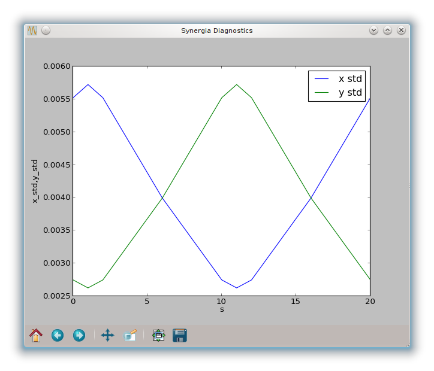

.. _section-fodo_simple1:

A first example: fodo_simple1
=============================

In this example, we will simulate a matched bunch passing through a FODO
cell. The FODO cell is defined by the file :file:`fodo.lat`, 
which uses Mad8 format.

:file:`fodo.lat`:

.. literalinclude:: ../../examples/fodo_simple1/fodo.lat
   :language: none
   
The simulation itself is defined by the Python script 
:file:`fodo_simple1.py`.

:file:`fodo_simple1.py`:

.. literalinclude:: ../../examples/fodo_simple1/fodo_simple1.py

Lattice definition
------------------

The :py:class:`synergia.lattice.Mad8_reader` class reads lattice files in 
Mad8 format and produces an object of type :cpp:class:`Lattice`, which
contains Synergia's description of the accelerator lattice. A 
:cpp:class:`MadX_reader` class is also available. Synergia can be extended 
with new reader classes.

Simulation step definition
--------------------------

A Synergia simulation is defined by a set of steps. These steps are produced
by a class derived from :cpp:class:`Stepper`. This example uses the simplest
stepper, :cpp:class:`Independent_stepper_elements`, which performs a fixed
number of steps per thick element and one step per thin element.

Bunch definition
----------------

A Synergia :cpp:class:`Bunch` contains a set of macroparticles representing
a given number of real particles.

.. note::

This example uses :py:func:`synergia.optics.generate_matched_bunch_transverse`,
which combines bunch generation with filling the bunch with a set of macroparticles
matched to a simulation. This interface will be changed before the Synergia 2.1
final release.

Bunch simulator definition
--------------------------

Synergia uses the :cpp:class:`Bunch_simulator` class to combine 
objects of type :cpp:class:`Bunch` with corresponding diagnostics objects.

Bunch diagnostic definition
---------------------------

Synergia has contains a variety of measurements to be applied to bunches at
various points in the simulation. The simulation applies measurements via
classes derived from :cpp:class:`Diagnostics` that have been added to the 
:cpp:class:`Bunch_simulator`. In this example we have decided to use 
:cpp:class:`Diagnostics_basic`, which creates a basic set of
diagnostics including means and standard deviations in all six phase-space
degrees of freedom. The diagnostics will be applied every step. Many more
options are available. See the various classes derived from 
:cpp:class:`Diagnostics` and the various :code:`add_per` methods of
:cpp:class:`Bunch_simulator`.

Performing the simulation
-------------------------

The :cpp:class:`Propagator` class actually performs the simulation. It applies
the steps from the Stepper class a number of times given by the :code:`turns`
parameter. The Propagator class performs propagation, diagnostics, arbitrary
actions and checkpointing. The detail of the output to the screen is determined
by the value of the :code:`verbosity` parameter. Simulation progress is always
written to the file :file:`log`.

Running the simulation
----------------------

Run the simulation using the :code:synergia executable::

   synergia fodo_simple1.py
   
which produces the following output::

   Propagator: starting turn 1
   Propagator:     step 1/8, s=1.0000, macroparticles = 50000, time = 0.025s
   Propagator:     step 2/8, s=2.0000, macroparticles = 50000, time = 0.022s
   Propagator:     step 3/8, s=6.0000, macroparticles = 50000, time = 0.023s
   Propagator:     step 4/8, s=10.0000, macroparticles = 50000, time = 0.019s
   Propagator:     step 5/8, s=11.0000, macroparticles = 50000, time = 0.022s
   Propagator:     step 6/8, s=12.0000, macroparticles = 50000, time = 0.025s
   Propagator:     step 7/8, s=16.0000, macroparticles = 50000, time = 0.022s
   Propagator:     step 8/8, s=20.0000, macroparticles = 50000, time = 0.023s
   Propagator: turn 1/1, macroparticles = 50000, time = 0.18s

Viewing the results
-------------------

The output of the simulation is contained in the HDF5 file
:file:`diagnostics.h5`. The HDF5 format is a widely-adopted standard; the data in
:file:`diagnostics.h5` can be analyzed using a number of standard applications, or
in end-user written code.
For simple analysis, Synergia2 includes several scripts for analyzing the output of
the various Diagnostics. The syndiagplot script can be used on :file:`diagnostics.h5`, e.g.,

::

   syndiagplot diagnostics.h5 --oneplot x_std y_std

which produces the following output:

