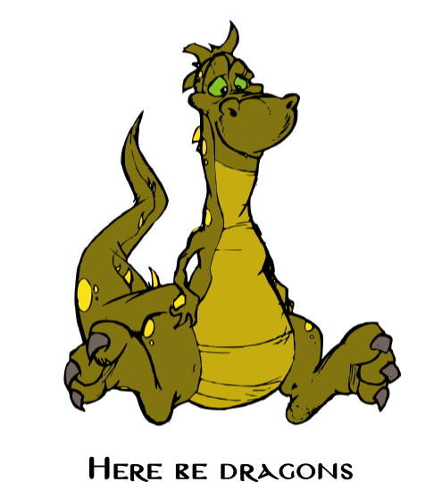

.. Synergia2 documentation master file, created by sphinx-quickstart on Tue Jun 23 13:50:50 2009.

Synergia2 documentation
=======================

.. warning::
   This manual is a work in progress. It has not been released, even in beta form. The first
   released version of the manual will be part of Synergia 2.1beta2.
   

   
Contents:

.. toctree::
   :maxdepth: 2

   overview
   tutorial
   units
   code_conventions
   tools
   api_reference
   chef

Indices and tables
==================

* :ref:`genindex`
* :ref:`modindex`
* :ref:`search`

