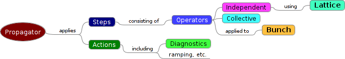

Overview
========

Introduction
------------

.. note::
   The content in this section is only a placeholder for the real content

* Accelerator simulation package

   * independent-particle physics

      * linear or nonlinear

   * collective effects

      * simple or computationally intensive

   * can go from simple to complex, changing one thing at a time

* Goal: best available physics models

   * ''best'' may or may not mean ''computationally intensive''

https://compacc.fnal.gov/projects/wiki/synergia2

* Designed for range of computing resources

   * laptops and desktops

   * clusters

   * supercomputers

* Goal: best available computer science for performance

   * significant interaction with computer science community

Physics
-------

.. note::
   The content in this section is only a placeholder for the real content

* Single-particle physics are provided by CHEF
    * direct symplectic tracking
        * magnets, cavities, drifts, etc.
    * (and/or) arbitrary-order polynomial maps
    * many advanced analysis features
        * nonlinear map analysis, including normal forms
        * lattice functions (multiple definitions)
        * tune and chromaticity calculation and adjustment
        * etc.
* Apertures
* Collective effects (single and multiple bunches)
    * space charge (3D, 2.5D, semi-analytic, multiple boundary conditions)
    * wake fields
        * can accommodate arbitrary wake functions

Space Charge in Synergia
^^^^^^^^^^^^^^^^^^^^^^^^

.. note::
   The content in this section is only a placeholder for the real content

* 3D open transverse boundary conditions
    * Hockney algorithm
    * open or periodic longitudinally
* 3D conducting rectangular transverse boundary
    * periodic longitudinally
* 3D conducting circular transverse boundary
    * periodic longitudinally
* 2.5D open boundary conditions
    * 2D calculation, scaled by density in longitudinal slices
* 2D semi-analytic
    * uses Bassetti-Erskine formula
    * $\sigma_x$ and $\sigma_y$ calculated on the fly
* New space charge models can be implemented by the end user

Synergia design
---------------

.. note::
   The content in this section is only a placeholder for the real content

* Synergia is a mix of C++ and Python
    * all computationally-intensive code is written in C++
    * user-created simulations are usually written in Python
        * pure-C++ simulations are possible
* Synergia provides a set of functions and classes for creating simulations
    * many examples available
* Virtually every aspect of Synergia is designed to be extendable by the end-user
    * code in C++ and/or Python

Synergia code structure
-----------------------

.. note::
   The content in this section is only a placeholder for the real content

* A simulation consists of propagating a :cpp:class:`Bunch` (or :cpp:class:`Bunch` es) through a :cpp:class:`Lattice`.
* Inputs: machine lattice, initial bunch parameters
* Outputs: user-selected :cpp:class:`Diagnostics`.

* :cpp:class:`Diagnostics`
    * 6D means
    * 6D std deviations
    * 6x6 covariance matrix
    * 6x6 correlation matrix
    * individual particle tracks
    * dump of all particles
    * losses at locations in lattice
    * can be extended

* :cpp:class:`Actions` can specify :cpp:class:`Diagnostics` will be applied
    * every *n* steps
    * every *m* turns
    * at specified sets of steps
    * at specified sets of turns
    * by user-specified logic
    * more

Checkpointing
^^^^^^^^^^^^^

.. note::
   The content in this section is only a placeholder for the real content

* Synergia simulations can be saved to disk (checkpointed) at any point
    * allows recovery from hardware failure
    * allows jobs that take longer than batch queue limits
* All simulation objects can be checkpointing
    * even, e.g., objects with open files
* Checkpointing available for both C++ and Python objects
    * *including end-user objects*
* User specifies parameters
    * every *n* turns
    * do *p* out of *q* total turns
    * send a message to stop at the end of next turn
